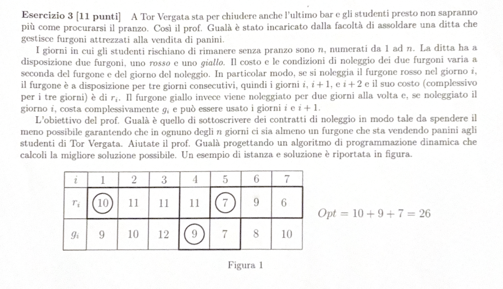

# TESTO: 

---

# IMPOSTAZIONE PROBLEMA: 

Abbiamo $n$ giorni. Per ogni giorno abbiamo 2 furgoni che portano il pranzo.
Furgone ROSSO: noleggio nel giorni i e noleggio per 3 giorni $(i, i + 1, i + 2)$ e pago $R_i$
Furgone GIALLO: noleggio nel giorni i e noleggio per 2 giorni $(i, i + 1)$ e pago $G_i$

---

# SOLUZIONE:
!!(Da Controllare)!!

OPT[i, c] = scegliendo un furgone di colore $c ∈ {Rosso, Giallo}$, si vuole minimizzare il  costo che pago per avere i furgoni nei giorni da $i$ a $n$. 

Ho 2 casi: 

**1° CASO:** Considero il caso in cui prendo il furgone Giallo nel giorno i 

$G_i + OPT[i + 2, G]$ -> (Prendo il giallo, e successivamente l'ottimo dato dal giallo)

$G_i + OPT[i + 1, R] + R_i$ -> (Prendo il rosso, e successivamente prendo l'ottimo dato dal rosso)

**2° CASO:** Considero ilcaso in cui prendo il furgone rosso nel giorno i

$R_i + OPT[i + 3, R]$ -> (Prendo il rosso, e successivamente l'ottimo dato dal rosso)

$R_i + OPT[i + 1, G] + G_i$ -> (Prendo il giallo, e successivamente prendo l'ottimo dato dal giallo)

> [!NOTE]
> ### Equazione di Bellman
> $$
> OPT(i, \text{stato}) = 
> \begin{cases} 
> 0 & \text{se } i > n \\ 
> \min 
> \begin{Bmatrix} 
> G_i + OPT(i + 2, G), & G_i + OPT(i + 1, R) + R_i \\ 
> R_i + OPT(i + 3, R), & R_i + OPT(i + 1, G) + G_i 
> \end{Bmatrix} & \text{altrimenti} 
> \end{cases}
> $$