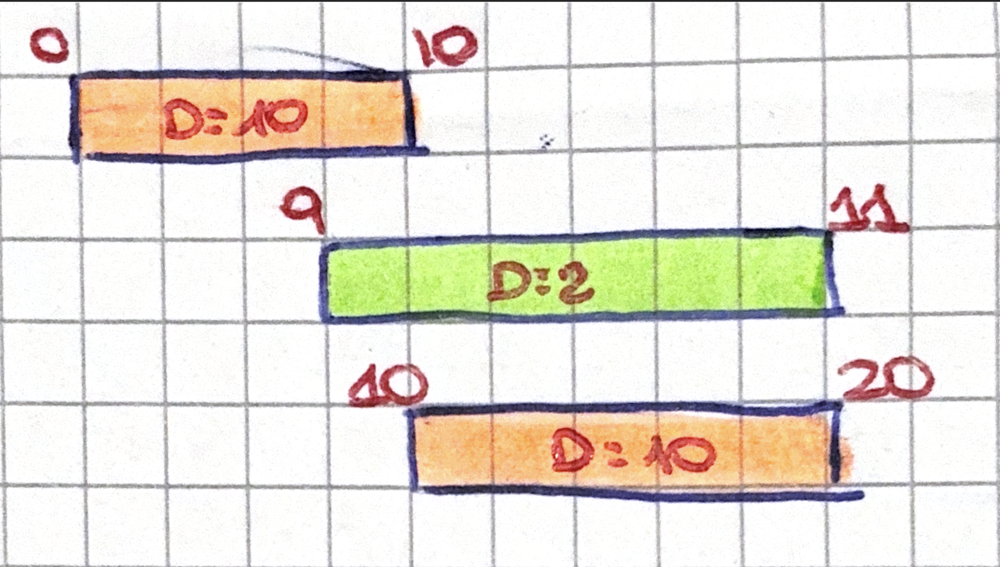

# TESTO: 

Si consideri il problema di INTERVAL SCHEDULING il cui input è un insieme di $n$ job dove 
il job $i-esimo$ ha un tempo di inizio e un tempo di fine. Si consideri l'algoritmo ottimo 
basato sull'approccio greedy. 

1. Indica qual'è l'ordine con cui A considera $i$ job 

2. Si mostri che il criterio greedy secondo cui i migliori job sono quelli che durano di meno (ovvero che minimizzano $F_i - S_i$) in generale non consente di trovare una soluzione ottima del problema

3. Si enunci in modo formale e preciso le proprietà chiave che permette di dimostrare che A è un algoritmo ottimo per Interval Scheduling 

---

# SOLUZIONE: 

1. L'algoritmo A che viene usato per risolvere il problema di INTERVAL SCHEDULING è l'algoritmo GREEDY: Earliest Finish Time. Questo algoritmo ordina gli $n$ job in ordine crescente di tempo di fine.

2. Un algoritmo Greedy chiamato Shortest interval, considera i job in ordine crescente di $f_j$ – $s_j$. Questo algoritmo fallisce, poichè: se un job corto inizia appena prima della fine di un job e finisce appena dopo l'inizio di un altro, li rende entrambi impossibili da pianificare. ESEMPIO IN FOTO

3. Avendo un insieme di Job $I_1, ... , I_k$ selezionati dal GREEDY ed avendo un insieme di Job $J_1, ... , J_m$ selezionati dall'OTTIMO 

Per dimostrare che A è ottimo, bisogna enunciare e dimostrare in primis un lemma, che dice: 

Per ogni $r = 1, ..., k$ avremo $f(I_k) <= f(J_k)$
-> ovvero che il job GREEDY finisce prima del Job OTTIMO

Questo lemma verrà DIMOSTRATO PER INDUZIONE: 
- per $r = 1$ sarà ovvio poichè il greedy prenderà sempre il job più piccolo 
- per $r > 1$ sarà pure ovvio poichè i job successivi devono essere compatibili con i precedenti 

Il Teorema che ci DIMOSTRA PER CONTRADDIZIONE che è l'algoritmo è ottimo. 

Infatti ipotizza che il greedy non è ottimo, quindi $$m > k$$
Se scelgo un $job_{k+1}$ che è compatibile con la soluzione ottima. 
Questo $job_{k+1}$ sarà compatibile pure con la soluzione greedy poichè il lemma ci dice che il greedy prende il più piccolo. Questo porterà ad affermare che $$m < k$$ il che è ASSURDO. 
Quindi il GREEDY è OTTIMO.
