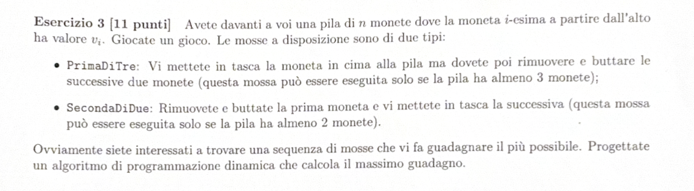

# TESTO: 

---

# RIEPILOGO PROBLEMA: 

Abbiamo $m$ monete, ed ogni moneta ha un valore $v_i$. 
Per giocare abbiamo 2 mosse a disposizione: 
- 1° MOSSA: Conservo la prima moneta, e buttate le 2 successive (mi servono 3 monete)
- 2° MOSSA: Butto la prima moneta, e conservo la successiva (mi servono 2 monete)

Vogliamo massimizzare il guadagno

---

# SOLUZIONE: 

Definisco OPT[i] = massimo guadagno delle prime i monete da $n$ a $i$ 

Ho 2 possibili casi: 
**1° CASO:** caso in cui sono sulla prima mossa: 
prendo $v_i$ il valore in cui sto + $OPT [ i - 3 ]$ (ottimo delle monete da $i - 3$ in poi, poichè devo fare 2 salti/ buttare le 2 successive)

**2° CASO:** caso in cui sono sulla seconda mossa: 
prendo $v_i-1$ il valore in cui sto + $OPT [ i - 2 ]$ (ottimo delle monete da i - 2 in poi, poichè devo fare 1 salto)

> [!NOTE]
> **Equazione di Bellman**
> 
> $$
> OPT(i) = \begin{cases} 
> 0 & \text{se } i = 0 \\
> \max \{ v_i + OPT(p(i)), OPT(i-1) \} & \text{altrimenti}
> \end{cases}
> $$
---

# COSTO: 

Il costo per calcolare 1 mossa è $O(1)$. 
Per $n$ monete sarà $O(n)$