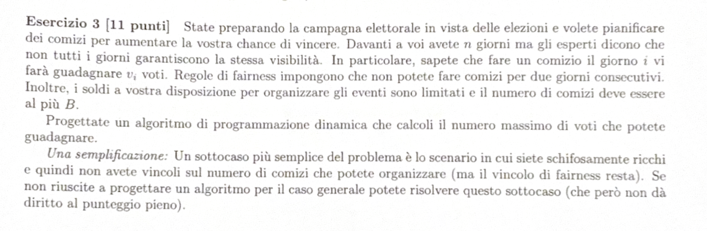

# TESTO: 

---

# RIEPILOGO PROBLEMA: 

Abbiamo n giorni di campagna elettorale. 
Per ogni giorno i abbiamo un guadagno $V_i$.
Non è possibile svolgere 2 comizi per 2 giorni consecutivi. 
Abbiamo a disposizione un budget limitato e possiamo fare al più B comizi, 
per il budget a nostra disposizione. 
Voglio massimizzare i voti che possi guadagnare durante i comizi.

---

# SOLUZIONE: 

Immaginiamo di rappresentare il problema su un array, dove: 
- ogni cella rappresenta gli $n$ giorni 
- il valore di ogni cella rappresenta il guadagno di voti $V_i$ per ogni comizio 

Definiamo il sottoproblema nel seguente modo:
OPT[i, B] =  numero massimo di voti che posso guadagnare effettualndo al più b comizi, dal giorno n al giorno i.

Possiamo dividere il problema in 2 casi possibili: 

**CASO 1:** Prendiamo l'ultimo giorno $V_n$
            $$V_n + OPT[i - 2, B]$$

**CASO 2:** Non prendo l'ultimo giorno 
            $$OPT[i - 1, B]$$

Definiamo l'equazione di Bellman nel seguente modo: 

> [!NOTE]
> **Equazione di Bellman Corretta**
> 
> $$
> OPT(i, B) = \begin{cases} 
> 0 & \text{se } i > n \\
> 1 & \text{se } OPT(1, B) \\
> \max \{ V_i + OPT(i - 2, B), OPT(i - 1, B) \} & \text{altrimenti}
> \end{cases}
> $$
