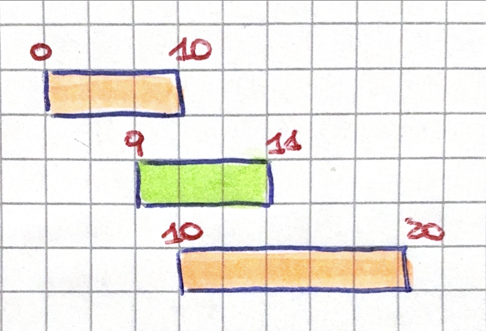
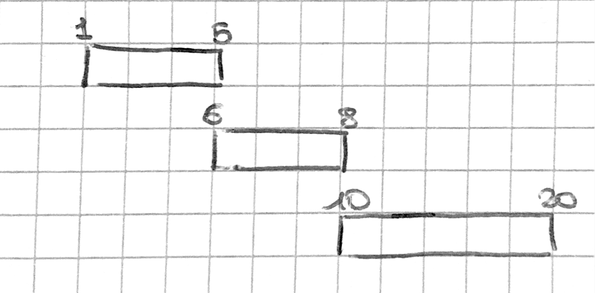

# TESTO 

Si consideri il problema dell’Interval Scheduling (IS).

1. Si definisca formalmente il problema di IS. 

2. Si argomenti sul perchè l’algoritmo greedy che guarda gli intervalli in ordine crescente di lunghezza non calcola una soluzione ottima.

3. Si definisca il criterio di ordinamento degli intervalli che porta all’algoritmo greedy corretto, ovvero l’algoritmo greedy che trova sempre una soluzione ottima del problema.

4. Si dimostri a grandi linee perchè l’algoritmo del punto (C) trova sempre una soluzione ottima del problema.

---

# SOLUZIONE

1. L'interval Scheduling è un problema che ci dice: Avendo un insieme di $n$ intervalli. Ogni intervallo $I_i$ ha un tempo di inizio $s_i$ e un tempo di fine $f_i$. Due intervalli $I_i$ e $I_j$ si dicono mutualmente compatibili se non si sovrappongono. Si vuole massimizzare il numero di intervalli mutualemnte compatibili. 

2. 

3. L'algoritmo Greedy corretto è **EARLIEST FINISH TIME**, che ordina in ordine crescente per tempo di fine gli $n$ intervalli. 

4. DIMOSTRAZIONE TRAMITE DISEGNO 

