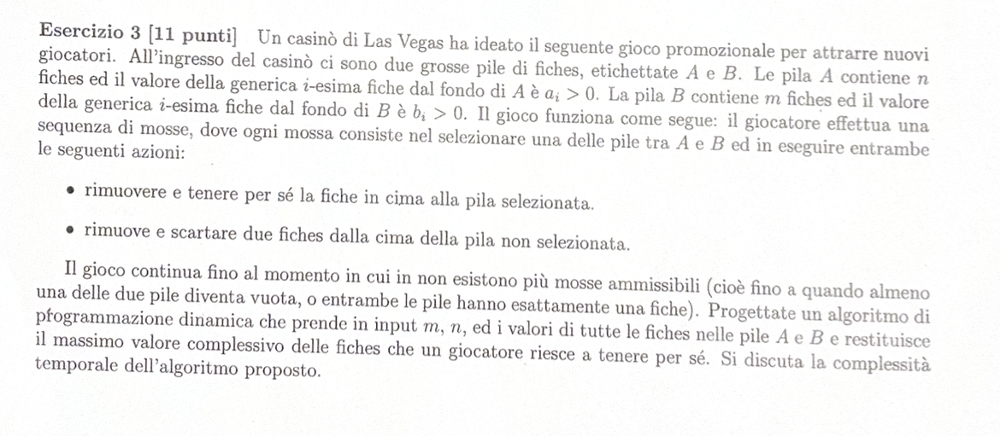

# TESTO: 

---

#RIEPILOGO PROBLEMA:
Ho $n$ fiches in A con valore $a_i$
Ho $m$ fiches in B con valore $b_i$
Il giocatore può fare 2 possibili mosse: 
- Rimuove la prima e la conservo (nella pila selezionata)
- Rimuove le prime due e le conserva (nella pila non selezionata)
Devo trovare il massimo valore di fiches ottenute.

---

# SOLUZIONE:

Definiamo OPT come: 

OPT[i,j] = Valore massimo di fiches ottenuto da $i$ a $n$ e da $j$ a $m$ nelle pile A e B

Avremo 2 casi: 
**1° CASO:** Sto sulla pila A e prendo $a_i$
             $$a_i + OPT[i-1, i-2]$$

**2° CASO:** Sto sulla pila B e prendo $b_j$
             $$b_j + OPT[i-2, j-1]$$

Dopo aver definito ciò, avrò la seguente Equazione di Bellman:

> [!NOTE]
> **Equazione di Bellman**
> $$
> OPT(i, j) = 
> \begin{cases} 
> 0 & \text{se } i > n \text{ e } j > m \\
> \max \{ a_i + OPT(i-1, i-2), b_j + OPT(i-2, j-1) \} & \text{altrimenti}
> \end{cases}
> $$