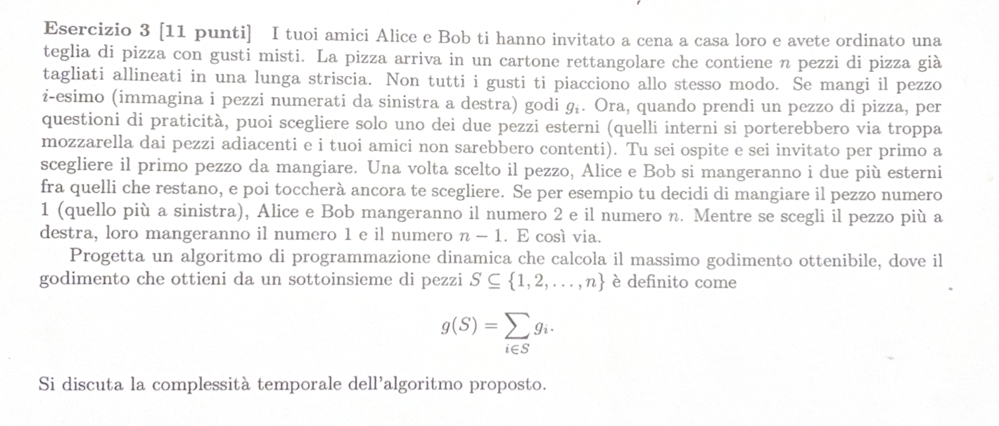

# TESTO:

---

# RIEPILOGO PROBLEMA: 

Abbiamo $n$ pezzi di pizza 
Per ogni pezzo di pizza ho un godimento $g_i$
Si possono mangiare solo pezzi esterni 
Io inizio a mangiare il primo pezzo di pizza
Bob e Alice mangiano i successivi 
ESEMPIO: 
- Io = 1 (sx), Bob = 2 (sx), Alice = n (dx)
- Io = n (dx), Bob = n-1 (dx), Alice = 1 (sx)

---

# SOLUZIONE: 

Definisco OPT[i][j] = il massimo godimento che ottengo avendo a disposizione i pezzi da $i$ a $j$

Avrò quindi 2 casi: 

**1° CASO:** Il caso in cui mangio il pezzo a dx
$$g_i + OPT[i + 1][j - 2]$$

**2° CASO:** Il caso in cui mangio il pezzo a sx
$$g_i + OPT[i + 2][j - 1]$$

Posso da questo scrivermi l'equazione di Bellman:

> [!NOTE]
> **Equazione di Bellman**
> $$
> OPT(i, j) = 
> \begin{cases} 
> 0 & \text{se } i > j \\
> \max \{ g_i + OPT(i + 1, j - 2), g_i + OPT(i + 2, j - 1) \} & \text{altrimenti}
> \end{cases}
> $$

La complessità dell'algoritmo è $O(n^2)$ poichè io scorro sia da sx sia da dx
