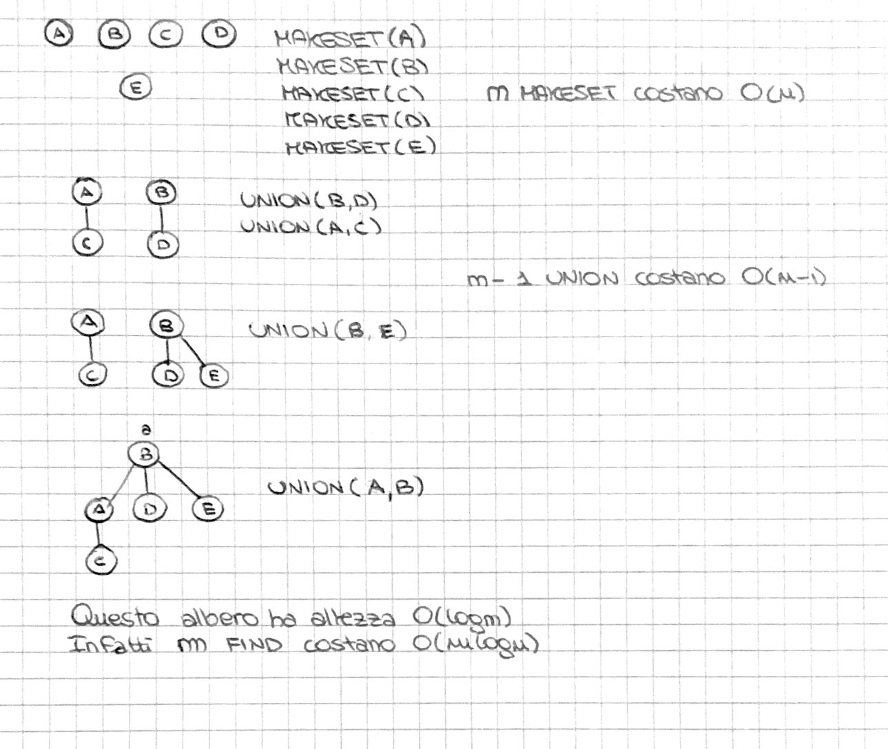

# TESTO: 

Si consideri la struttura dati QuickUnion con euristica union by size. Si mostri una sequenza
di operazioni di $n$ makeSet e $n − 1$ union in cui l’albero ottenuto abbia altezza $Θ(log n)$

---

# SOLUZIONE: 

La QuickUnion con euristica union by size ha 3 operazioni che hanno i seguenti costi: 
- makeset - $O(1)$
- union - $O(1)$
- find - $O(log n)$ poichè ha costo ammorizzato grazie all'euristica
Definiamo s = size (numero nodi albero) e h = altezza avremo $s \geq 2^h$, moltiplicando entrambi i membri per $log$ otteniamo $h \leq log n (n = s)$
Una sequenza di $n$ makeset, $n - 1$ union, $m$ find sarà la seguente: 
