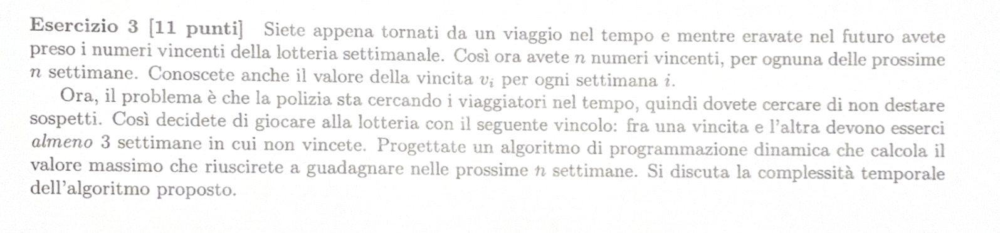

# TESTO: 

---

# IMPOSTAZIONE PROBLEMA: 

Abbiamo $n$ settimane, per ogni $i$ settimana abbiamo una vincita $V_i$.
Fra una vincita e un'altra ci sono 3 settimane. 
Vogliamo massimizzare il guadagno nelle $n$ settimane.

---

# SOLUZIONE: 

OPT[i] = massima vincita guadagnata nelle settimane da $n$ a $i$ 

Avremo 2 casi: 

**1° CASO:** Prendo la vincita su cui sto
             $$V_i + OPT[ i - 4 ]$$

**2° CASO:** Non prendo la vincita su cui sto 
         $$OPT[ i - 1 ]$$

Definisco l'equazione di Bellman nel segunete modo: 

> [!NOTE]
> **Equazione di Bellman**
> $$
> OPT(i) = 
> \begin{cases} 
> 0 & \text{se } i > n \\
> \max \{ V_i + OPT[i - 4], OPT[i - 1] \} & \text{altrimenti}
> \end{cases}
> $$

La complessità temporale dell'algoritmo è $O(n)$, poichè ogni volta che sceglo una vincita 
avrò un costo di $O(1)$, per n settimane avrò un costo toale di $$O(n)$$. 