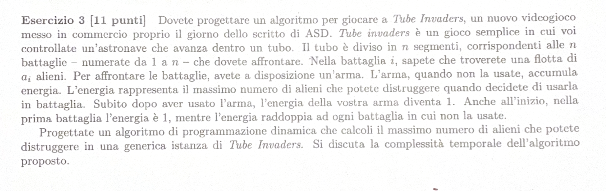

# TESTO: 

---

# RIEPILOGO PROBLEMA: 
Ho n segmenti, per ogni segmento ho un numero di alieni $A_i$
Per sconfiggere gli alieni ho un'arma che mi accumula energia (questa energia mi corrisponde 
al numero massimo di alieni che posso distruggere). 
All'inizio l'arma avrà 
$ \text{energia} = 1$
Dopo aver usato l'arma, questa avrà $\text{energia} = 1$
Se non uso l'arma, questa avrà $\text{energia} = 2C_a$

---

# SOLUZIONE: 

DA SVOLGERE