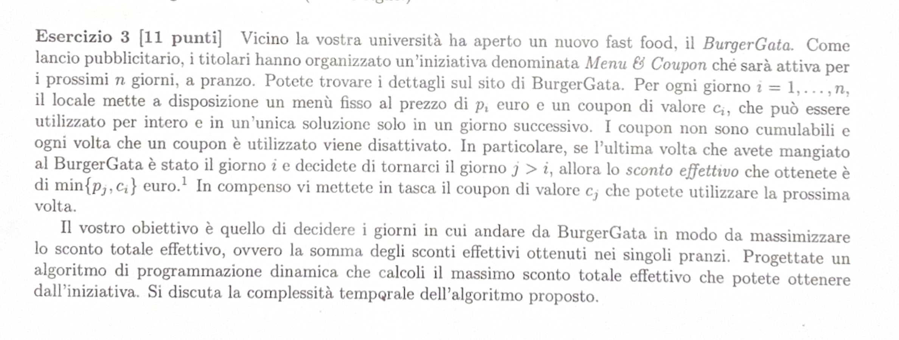

# TESTO: 

---

# RIEPILOGO PROBLEMA: 

Ho $n$ giorni e per ogni giorno ho un prezzo $P_i$ e un coupon $C_i$.
Se vado a mangiare in quel ristorante al giorno $j > i$ pagherò il $min \{ pj, ci \}$.
Vogliamo massimizzare lo sconto minimo ottenuto dai singoli pranzi. 

---

# SOLUZIONE: 

OPT[p_j] = massimo sconto ottenuto nei giorni da $i$ a $n$

Possiamo definire l'equazione di Bellman nel seguente modo: 

> [!NOTE]
> **Equazione di Bellman**
> $$
> OPT(i, j) = 
> \begin{cases} 
> 0 & \text{se } i > j \\
> \max_{j > i} \{ OPT[P_j] + \min \{ P_j, C_j - 1 \} \} & \text{altrimenti}
> \end{cases}
> $$

La complessità temporale è $O(n)$, poichè calcolare ogni sconto costa $O(1)$, per $n$ giorni allora $$O(n)$$
